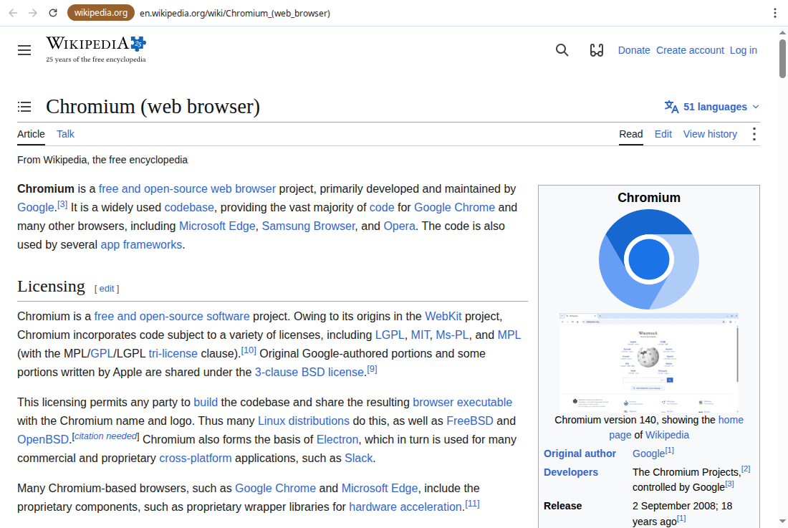

# cro-minimum

The minimum Chromium. A Chromium-based browser with the smallest memory footprint that still
browses the mainstream web, for machines where every kilobyte counts:
2 GB laptops, a 1 GB Raspberry Pi, or any computer whose RAM other programs
already hold.



It is built on Chromium's `//content` layer, not the Chrome product, and
follows Chromium's Stable releases. Every change is judged by measured
memory, and keeping mainstream sites working is the hard constraint. The
numbers and how to reproduce them are in [MEASUREMENTS.md](MEASUREMENTS.md).

The browser's programs are called `lrb` (low-ram-browser) and
`lrb_coordinator`.

**Status: experimental.** It is usable day to day, but the whole-browser
OS confinement (Landlock, seccomp) that replaces Chromium's per-renderer
sandbox isn't built yet. Until it is, don't use lrb for accounts that matter.

## How it saves memory

- **One site per window, one process per window.** Each site gets its own
  single-process browser instance and its own profile, so sites never share
  a process or a cookie jar. Tabs exist within a site's window. Leaving a
  site replaces the window. ([docs/design.md](docs/design.md))
- **Pressure-driven.** Background tabs and windows sleep under memory
  pressure, keeping their history, and the oldest close only as a last
  resort. A small coordinator process that never loads web content decides.
- **Content blocking** with Brave's adblock-rust (uBlock Origin-compatible
  lists), built once and shared read-only by every instance.
- **No autoplay**, muted or not, before the user interacts with the page.
- **Lean defaults:** software compositing (the GPU is an option),
  low-end-device mode, V8 optimizing for size, no back-forward cache, no
  prerendering, and Stable's feature defaults without Chromium's
  experiment test config.
- **A native slim bar** (Views, about 2 MB per window) rather than an HTML
  one.

## Safety and privacy defaults

- No permission without the user saying yes. Camera, microphone and
  clipboard reading are asked about in the window and remembered per site.
  Everything else is refused.
- Downloads always ask where to save.
- No remote-debugging server unless explicitly asked for.
- Origin trials use Chromium's production key.

## Building and running

Linux x86-64 build machine, about 100 GB of disk and 32 GB of RAM. Builds
x64 and arm64. See [docs/building.md](docs/building.md).

```sh
build/setup_checkout.sh      # depot_tools + Chromium at CHROMIUM_COMMIT
build/apply_patches.sh       # patches/ onto the checkout
build/build.sh x64           # -> dist/lrb-x64-<commit>.tar.zst
tar --zstd -xf dist/lrb-x64-*.tar.zst
content-shell/lrb_coordinator https://en.wikipedia.org
```

Tests: `phase0/run_tests.sh` (some open windows on `$DISPLAY`, some need
network access).

## Layout

| Path | What |
|---|---|
| `lrb/` | The browser: a `//content` embedder (`//lrb` in the Chromium checkout), its coordinator and content blocking. |
| `patches/` | The only changes to Chromium itself, as `git am` patches against `CHROMIUM_COMMIT`. |
| `build/` | Checkout, patch, build, package, and follow Stable (`update_stable.sh`). |
| `phase0/` | Memory harness (Python standard library only, runs on target devices) and the test suite. |
| `CHROMIUM_COMMIT` | The Chromium Stable release lrb builds on. |
| `CHROMIUM_REVISION` | The Chromium snapshot used as a measurement reference (`phase0/fetch_prebuilt.sh`). |
| `docs/` | Design, building, measuring. |

## License

BSD-3-Clause ([LICENSE](LICENSE)). Third-party code and licenses:
[THIRD_PARTY.md](THIRD_PARTY.md).
